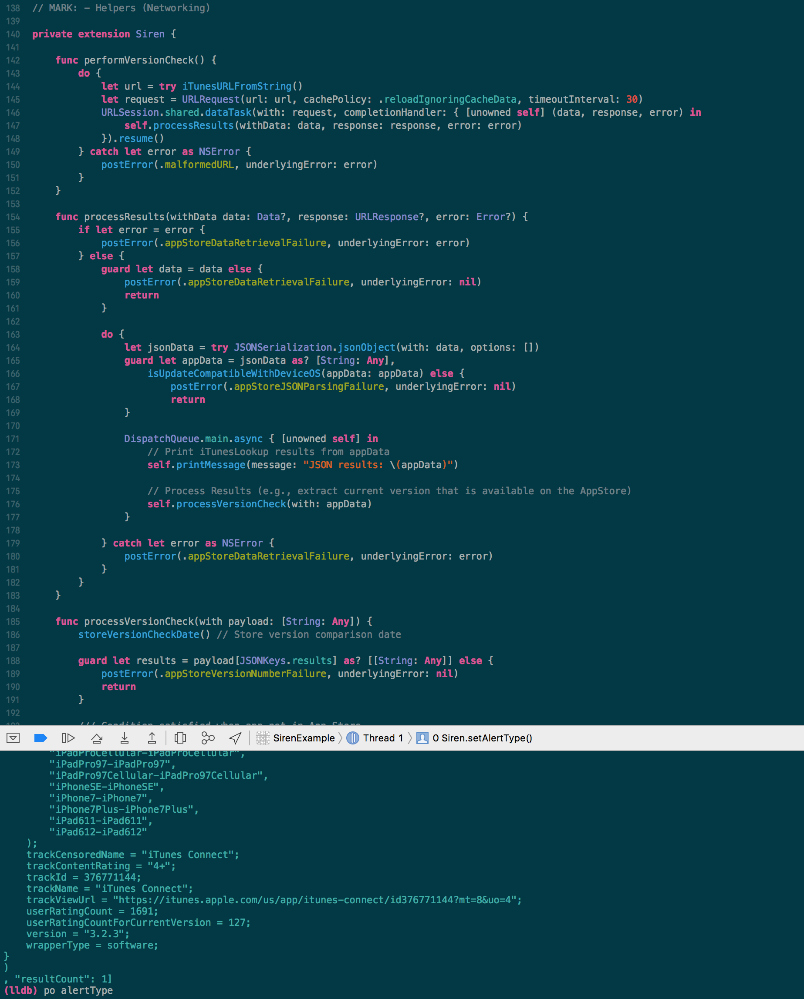

# Solarized Light & Dark Theme for Xcode

## Background
This theme works with Xcode 8 and 9.

This theme used to work with Xcode 5, 6, and 7, but due to the changes to the theme editor, this theme is no longer compatible.

## Installation

### Automatic (via script)
```
./install.sh
```

which will install the file in Xcode `FontAndColorThemes` directory.

- Restart Xcode
- Go to preferences and select **Solarized Dark**

### Manual Installation
Copy the .xccolortheme file into the following directory:

```
~/Library/Developer/Xcode/UserData/FontAndColorThemes
```

- Restart Xcode
- Go to preferences and select **Solarized Dark**
### Screenshot
Solarized Dark Screen

Screenshot_Dark

Screenshot_Light

